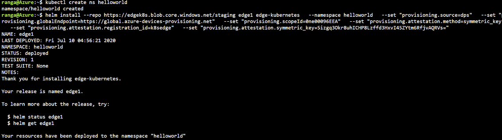

## Azure IoT Edge on Kubernetes Connnected to IoT Central

   

This tutorial demonstrates a scenario of deploying a simulated temperature sensor edge module. It requires a Kubernetes cluster with Helm initialized and `kubectl` installed as noted in the [prerequisites](./prereqs.md). This tutorial will use an AKS cluster deployed on Azure.

### IoT Central Prerequisites
1. Follow the Prerequisites section of this [doc](https://docs.microsoft.com/en-us/azure/iot-central/core/tutorial-add-edge-as-leaf-device#prerequisites) to setup an IoT Central application

2. Create a device template, follow the section in this [doc](https://docs.microsoft.com/en-us/azure/iot-central/core/tutorial-add-edge-as-leaf-device#create-device-template)

3. Add IoT Edge Device, follow the section in this [doc](https://docs.microsoft.com/en-us/azure/iot-central/core/tutorial-add-edge-as-leaf-device#add-iot-edge-device)


### Setup steps for provisoning Edge device to Central

1. Once you have an AKS cluster deployed go to **shell.azure.com**

   

2. Set your subscription where you deployed AKS cluster

    ```bash
    $ az account set --subscription "<your azure subscription name>"
    ```

3. To get Credentials run the following command

    ```bash
    $ az aks get-credentials --resource-group <your resource group name> --name <your AKS cluster name>
    ```

4. Install Helm

    ```bash
    $ wget https://get.helm.sh/helm-v3.3.0-rc.1-linux-amd64.tar.gz
    $ tar -zxvf helm-v3.3.0-rc.1-linux-amd64.tar.gz
    ```

5. Create a Kubernetes namespace to install the edge deployment into.

    ```bash
    kubectl create ns helloworld 
    ```

6. Install IoT Edge Custom Resource Definition (CRD).

    ```bash
    helm install --repo https://edgek8s.blob.core.windows.net/staging edge-crd edge-kubernetes-crd  
    ```

7. Deploy the edge workload into the previously created K8s namespace.

    > 
    > For simplicity, this tutorial doesn't specify a persistent store for `iotedged` during install. However, for any serious/PoC deployment, follow the best practice example shown in the [iotedged failure resilience tutorial](./ha.html).

    ```bash

    # Install edge deployment into the created namespace, get scope id, symmetric key and device id/registration id from IoT Central. In IoT Central go to device explorer, select your edge device and click **Connect** button to get the details.  
    helm install --repo https://edgek8s.blob.core.windows.net/staging edge1 edge-kubernetes \
      --namespace helloworld \
      --set "provisioning.source=dps" \
      --set "provisioning.globalEndpoint=https://global.azure-devices-provisioning.net" \
      --set "provisioning.scopeId=<your scope id>" \
      --set "provisioning.attestation.method=symmetric_key" \
      --set "provisioning.attestation.registration_id=<your device id>" \
      --set "provisioning.attestation.symmetric_key=<your device symmetric key>" \
    ```

     

6. In a couple of minutes, you should see the workload modules defined in the edge deploymentment running as pods along with `edgeagent` and `iotedged`. Confirm this using:

    ```bash
    kubectl get pods -n helloworld

    ```
     

### Cleanup

```bash
# Cleanup
helm del edge1 -n helloworld && \
kubectl delete ns helloworld
 ```` 
 ...will remove all the  Kubernetes resources deployed as part of the edge deployment in this example (IoT Edge CRD will not be deleted).

